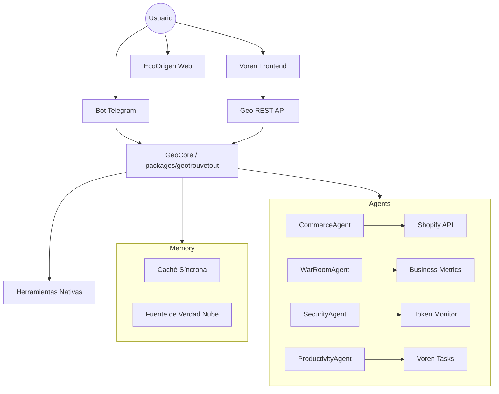

# Arquitectura de Geo OS (Master App)

## Hub Central de Inteligencia
El sistema se basa en una arquitectura de **Orquestador Central (GeoCore)** con delegación a **Sub-Agentes especializados**.

## Flujo de Datos
1.  **Entrada**: El usuario envía una petición vía Telegram o Web.
2.  **Orquestación**: GeoCore recibe la petición, consulta la memoria reciente y decide si necesita una herramienta o un agente.
3.  **Ejecución**: Se invoca la función o el sub-agente.
4.  **Respuesta**: Se consolida el resultado y se envía al usuario, guardando todo en el historial unificado.
